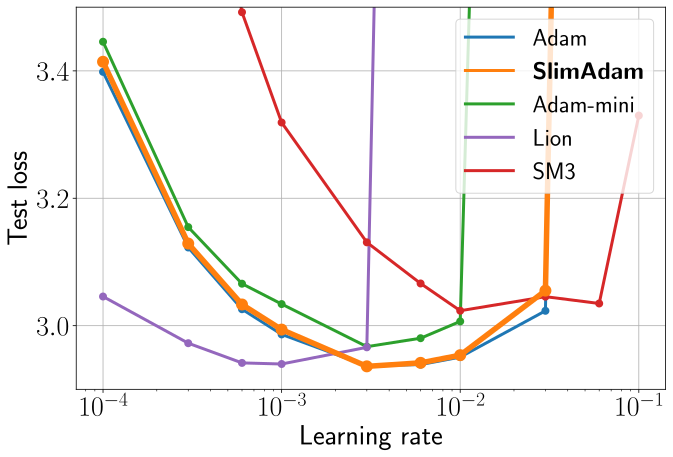

# When Can You Get Away with Low Memory Adam?
This repository contains the code implementation for the paper 'When Can You Get Away with Low Memory Adam?'




## Overview
Adam is the go-to optimizer for training modern machine learning models, but it requires additional memory to maintain the moving averages of gradients and their squares.

We perform a simple layer-wise Signal-to-Noise Ratio (SNR) analysis to quantify when second-moment tensors can be effectively replaced by their means across different dimensions. 
SNR analysis naturally leads to SlimAdam, a memory-efficient Adam variant that compresses the second moments along dimensions with high SNR when feasible, and leaves when compression would be detrimental.
 
### Key Features
- 🚀 **Memory Efficient**: Reduces Adam's memory footprint by up to 98%
- 💪 **Performance Efficacy**: Maintains Adam's performance
- 🔄 **Drop-in Replacement**: Works with the same hyperparameters as Adam, no learning rate retuning needed

## Quick Start

```python
from utils.slimadam import SlimAdamW

optimizer = SlimAdamW(
   model.named_parameters(), 
   lr = learning_rate, 
   betas = (beta1, beta2),
   weight_decay = weight_decay,
   rules_json_path = rules/slimadam.json,
   layer_map_path = None,
)
```

### Compression Modes

SlimAdam can operate in two different modes:
1. **SNR Auto Mode**: Dynamically generates compression rules by analyzing the Signal-to-Noise Ratio (SNR) for the given training recipe. The derived rules are then provided using the `rules_json_path` argument to the optimizer.
2. **Static Mode**: Static Mode applies fixed compression rules based on layer types, according to Table 1 in the paper. Activate this by setting `layer_map_path='layer_map.json'` and `rules_json_path=None`

Note: Only one compression mode can be active at a time. Either `rules_json_path` or `layer_map_path` must be specified, with the other set to `None`.

## Detailed Usage

### 1. SNR Auto Mode (Recommended)

SNR Auto Mode analyzes the SNR during training to automatically determine optimal compression rules for the given training recipe. 

Step 1: Perform SNR Analysis during an Adam run

Train the model with Adam by setting `rules_json_path=None` and `rules_json_path=None`.

```python 
optimizer = SlimAdamW(
    model.named_parameters(),
    lr = learning_rate,
    betas = (beta1, beta2),
    weight_decay = weight_decay,
    rules_json_path = None,  # No compression rules
    layer_map_path = None,   # No layer mapping
    verbose = True
)
```

Import and intialize SNR Tracker

```python 
from utils.snr_tracker import SNRTracker

# Initialize tracker
snr_tracker = SNRTracker()
```

Specify Where the Tracker Measures in Training
```python
for step in range(num_steps):
   batch = next(dataloader)
   # Forward pass
   logits = model(batch.inputs)
        
   # Compute loss
   loss = loss_fn(logits, batch.labels)
        
   # Backward pass
   optimizer.zero_grad()
   loss.backward()
   optimizer.step()
        
   # Measure SNR
   if snr_tracker.should_measure(step):
      snr_tracker.measure_and_save(model = model, optimizer = optimizer, step = step,)
```

At the end of training, save the snr data

```python
snr_tracker.save_all_results(snr_filename)
```

Generate compression rules from the collected SNR data by running:

```python 
python get_rules_slim_snr.py --snr_filename snr_filename
```

This analyzes SNR trends to generate model-specific compression rules in `rules/slimadam.json`.

Apply the derived rules for your full training run:

```python
optimizer = SlimAdamW(
    model.named_parameters(),
    lr = learning_rate,
    betas = (beta1, beta2),
    weight_decay = weight_decay,
    rules_json_pat h ='rules/slimadam.json',
    layer_map_path = None,
    verbose = True
)
```

Note: The SNR analysis can be performed with a smaller model or batch size to save computational resources, as the SNR patterns tend to be consistent across model scales as described in the paper.

### 2. Static Mode

Static Mode applies fixed compression rules based on layer types, according to Table 1 in the paper.

Setup Process:

Simply use SlimAdamW with the provided default layer mapping:
```python
optimizer = SlimAdamW(
    model.named_parameters(),
    lr = learning_rate,
    betas = (beta1, beta2),
    weight_decay = weight_decay,
    rules_json_path = None, # set rules path to None
    layer_map_path = 'layer_map.json',  # Default mapping provided with the repository
    verbose = True
)
```
The provided layer_map.json contains mappings between parameter names and layer types. You only need to edit this file if your model uses different naming conventions than standard architectures.